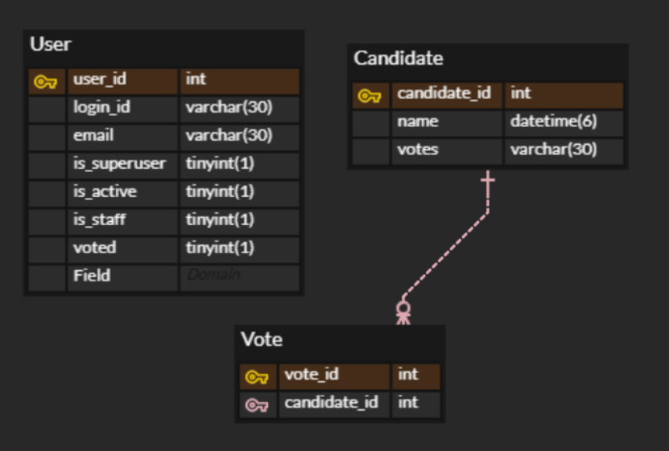
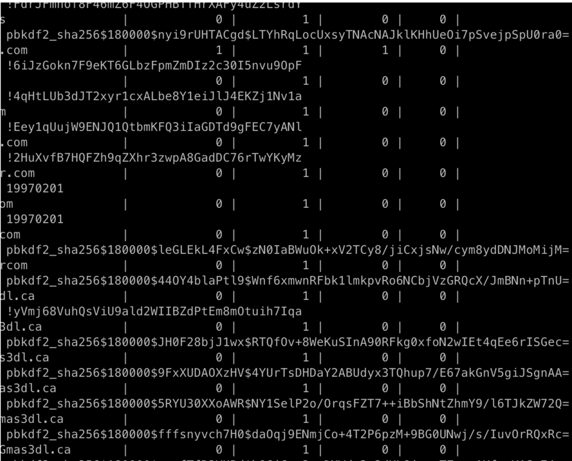

# 15기 파트장 투표 어플리케이션
## Team Chat-Minder💬

### ✔ [API 문서](https://documenter.getpostman.com/view/14842658/UVJhDunp)

### ✔ ERD




### ✔ [투표하기](https://react-vote-14th-ten.vercel.app)


### 준환
* 회원가입, 로그인 담당

`viewset`을 사용하지 않고, `APIView`을 사용했다.
처음에 `viewset`을 사용해서 만들었었는데  
너무 추상화 되어있기 때문에, 작은 부분들을 수정할 때 어려울 것이라고 느꼈다.

#### 로그인 과정  
원래는 쿠키를 사용해서 토큰을 담아주고 인증하는 방식으로 만들려고 했으나, 도메인이 달라 쿠키가 저장되지 않는 이슈가 발생했다.
따라서 응답으로 주고, 프론트에서 그것을 파싱해서 쓰는 방식으로 바꾸었다.


#### 비밀번호 저장 이슈  

`SHA256` 방식으로 저장되지 않아, `check_password` 메서드로 비밀번호가 인증되지 않는 오류를 2일동안 겪었다.
`pbkdf2_sha256$180000$leGLEkL4FxCw$zN0IaBWuOk+xV2TCy8/jiCxjsNw/cym8ydDNJMoMijM=`  
이런식으로 앞에 `pbkdf2_sha256`이 달려있는 암호화 방식이여야 인증이 된다.


#### 회원가입 
* /users POST

```python
# view
def post(self, request):
    data = JSONParser().parse(request)
    serializer = UserSerializer(data=data)
    if serializer.is_valid():
        serializer.save()
        return Response(serializer.data, status=status.HTTP_201_CREATED)
    return Response(serializer.errors, status=status.HTTP_400_BAD_REQUEST)

# serializer
class UserSerializer(serializers.ModelSerializer):
    login_id = serializers.CharField(required=False)
    password = serializers.CharField(write_only=True, required=False)
    email = serializers.CharField(required=False)

    class Meta:
        model = User
        fields = '__all__'

    def create(self, validated_data):
        login_id = validated_data.get('login_id')
        email = validated_data.get('email')
        password = validated_data.get('password')
        user = User(
            login_id=login_id,
            email=email
        )
        user.set_password(password)
        user.save()
        return user

```

#### 로그인
* /auth/token POST
```python
# view
def post(self, request):
        data = JSONParser().parse(request)
        serializer = TokenSerializer(data=data)
        if serializer.is_valid():
            res = Response(serializer.data, status=status.HTTP_200_OK)
            return res
        return Response(serializer.errors, status=status.HTTP_400_BAD_REQUEST


# token serializer
# TokenObtainPairSerializer를 상속받은 클래스
# validate 함수를 override 해서 사용했다. 
class TokenSerializer(TokenObtainPairSerializer):
    id = serializers.UUIDField(required=False, read_only=True)
    login_id = serializers.CharField(max_length=30, write_only=True)
    password = serializers.CharField(max_length=30, write_only=True)

    email = serializers.CharField(read_only=True)
    refresh = serializers.CharField(read_only=True)
    access = serializers.CharField(read_only=True)
    
    ...
    
def validate(self, data):
    login_id = data.get('login_id')
    password = data.get('password')
    user = authenticate(login_id=login_id, password=password)
    if user is None:
        raise serializers.ValidationError(detail=True)

    validated_data = super().validate(data)
    refresh = self.get_token(user)
    validated_data["refresh"] = str(refresh)
    validated_data["access"] = str(refresh.access_token)
    validated_data["email"] = user.email
    validated_data["login_id"] = user.login_id
    validated_data["id"] = user.id

    return validated_data
```


#### 인증 방식

```python
def get(self, request):
  if request.user.is_anonymous:
      return Response("알 수 없는 유저 입니다.", status=status.HTTP_404_NOT_FOUND)
  serializer = UserSerializer(request.user)
  return Response(serializer.data, status=status.HTTP_200_OK)
```
authorization header에 토큰을 넣어주면 간편하게 인증이 되기 때문에 request.user를 단순히 확인하는 방식으로 유저를 특정할 수 있다.


#### https 설정
원래는 쿠키를 사용할 예정이었기 때문에, 도메인을 확보하고 ssl 인증서를 넣어서 https를 만들었다.  
너무 많이 삽질하고 스트레스 받았어서 다른팀들은 편하게 했으면 해서 남김.

* `letsencrypt` 를 이용하면 무료로 ssl 인증서를 만들 수 있다.
* 인증서 발급 방식 : webroot

1. aws ec2 서버에 접속하여 certbot을 설치한다.  
2. `certbot certonly --manual` 를 입력한다.
3. 그러면 뭐 약관 동의하고 도메인 입력하라고 나오는데, 도메인 입력한다.
4. 지금 인증받는 사용자가 도메인을 제어하는지 확인하기 위해서 과제가 주어진다.
5. http://{my_doman}/.well-known/acme-challenge/{hash} 에 {머시기} 가 출력되어야 한다는 메시지가 뜸
6. 저는 django docker 끄고 nginx만 살린상태에서 다음과 같은 코드를 `nginx.conf` 에 추가함
```
location ^~ /.well-known/acme-challenge/ {
   default_type "text/plain";
   root     /usr/share/nginx/html;
}
```
7. 이렇게 하고 나서 `nginx` 컨테이너로 직접 접속한 뒤, /usr/share/nginx/html 경로로 들어가서 .well-known/acme-challenge 경로를 만들어줌
8. vi {hash} 해서 임의 파일 만들고 {머시기} 넣어준 뒤 :wq
9. 이렇게 하고 다시 서버 터미널로 돌아가서 과제 했다고 엔터하면 인증서가 발급됨
10. 근데 그게 /etc/letsencrypt/archive/{도메인} 이라는 경로에 있음 이걸 저는 마운트 해서 사용함
11. docker-compose.prod.yml 에다가 다음과 같이 추가
```yaml
volumes:
    - static:/home/app/web/static
    - media:/home/app/web/media
    - /etc/letsencrypt/archive/chatminder.cf:/etc/nginx/conf.d/certificate
```

12. 그러면 /etc/letsencrypt/archive/chatminder.cf 이 폴더가 docker 내부에선 /etc/nginx/conf.d/certificate 이게됨 
13. nginx.conf에 다음과 같이 추가
```
server {
  listen 443 ssl;

  server_name api.chatminder.cf;

  ssl_certificate /etc/nginx/conf.d/certificate/fullchain1.pem;
  ssl_certificate_key /etc/nginx/conf.d/certificate/privkey1.pem;

  location / {
      proxy_pass http://vote;
      proxy_set_header X-Forwarded-For $proxy_add_x_forwarded_for;
      proxy_set_header Host $host;
  }
```
14. docker-compose nginx 부분에서 443포트 개방 
```yaml
ports:
      - "80:80"
      - "443:443"
```
15. 저장하고 다시 도커 올리면 https로 접속됨

아마 요즘 보안때문에 전부 https 사용하실텐데.. 너무 짜증났어서 정리해서 올려요..

### 채리

* 투표기능 담당

### Model
```python
from django.db import models
from api.models import BaseModel


class Candidate(BaseModel): #후보자 생성 및 등록
    name = models.CharField(max_length=250, null=False, blank=False)
    votes = models.IntegerField(default=0)#투표 여부

    def __str__(self):
        return self.name


class Vote(BaseModel):
    candidate = models.ForeignKey(Candidate, on_delete=models.CASCADE, related_name='candidate')

    def save(self, *args, **kwargs):
        self.candidate.votes += 1
        self.candidate.save()
        super().save(*args, **kwargs)

    def __str__(self):
        return '{} voted'.format(self.candidate.name)
```

* save() 메소드 오버라이딩하여 투표 요청이 들어오면 바로 해당 후보의 득표수를 증가시켜주어 DB에 저장
* vote과 candidate을 foreign key로 연결할여 1:M 맵핑


### Serializer

```python
class CandidateSerializer(serializers.ModelSerializer):
    class Meta:
        model = Candidate
        fields = '__all__'


class VoteSerializer(serializers.ModelSerializer):
    candidate_name = serializers.CharField(write_only=True)

    def create(self, validated_data):
        candidate = get_object_or_404(Candidate, name=validated_data["candidate_name"])
        vote = Vote()
        vote.candidate = candidate
        vote.save()
        return vote

    class Meta:
        model = Vote
        fields = ('candidate_name',)

```
* create()메소드 오버라이딩해줘서 request로 전달된 데이터를 vote객체에 저장하여 다시 객체 리턴

### View

```python
class CastVote(APIView):
    permission_classes = [IsOwnerOrSuperuser, ]

    def post(self, request):
        user = request.user
        serializer = VoteSerializer(data=request.data)
        if user.is_anonymous: #로그인 되어있는지 확인 
            return Response("알 수 없는 유저 입니다.", status=status.HTTP_404_NOT_FOUND)
        else:
            if user.voted: #유저가 투표했는지
                return Response(
                    {
                        "message": "이미 투표하셨습니다"
                    },
                    status=status.HTTP_400_BAD_REQUEST
                )
            else:
                if serializer.is_valid(): #유효성 검사 진행
                    serializer.create(validated_data=request.data)
                    user.voted = True
                    user.save()
                    return Response(
                        {
                            "message": "투표 성공"
                        },
                        status=status.HTTP_200_OK
                    )
                return Response(status=status.HTTP_400_BAD_REQUEST)

```

* Modelviewset을 사용하지 않고 함수형 뷰를 사용하여 APIview 작성
* 유저 인증 방식은 위에서 설명해준대로 request.user를 사용하여 유저의 정보를 확인